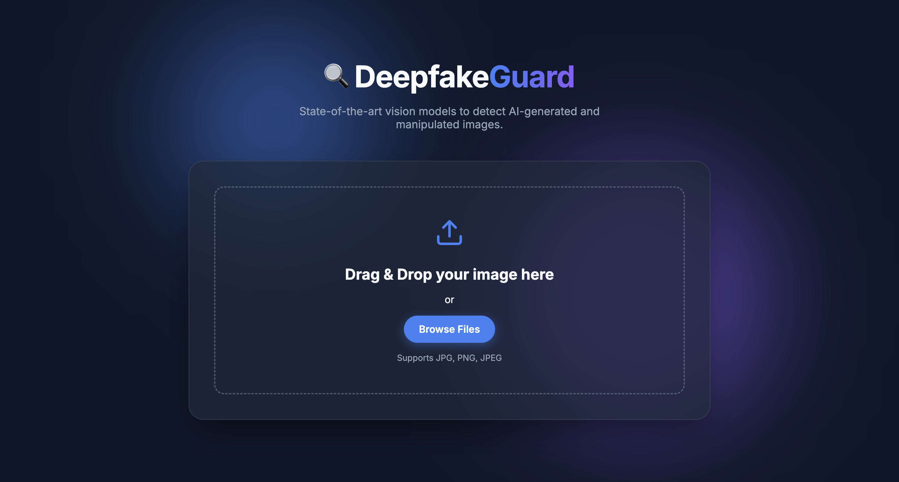
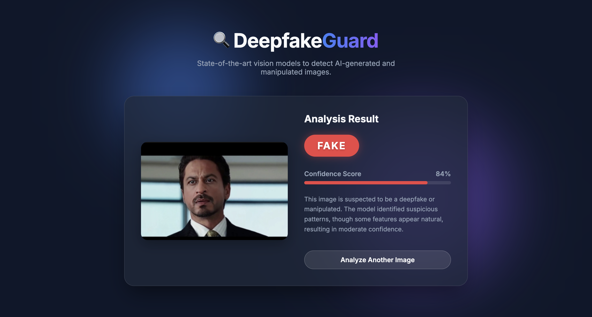

<div align="center">
  
  
  <h1>🧠 Deepfake Detection Web App</h1>
  <p><i>A full-stack AI-powered web application that detects whether an uploaded image is Real or AI-generated (Deepfake) using a deep learning model.</i></p>

  <p>
    
    
    
    
  </p>
</div>

---

## 🎓 Academic Context
**Institution:** KIET GROUP OF INSTITUTIONS 
**Degree:** B.Tech in COMPUTER SCIENCE
**Project Type:** Major Project  
**Team Members:**
- PRASHANT KUMAR JHA  2300290120163
- PREET SAGAR         2300290120168
- SOUMYA CHOUDHARY    2300290120215
- ROHIT SINGH         2300290120197

**Project Guide:** BHAGWAN KRISHNA GUPTA

---

## 🎯 Objectives

- Develop a deep learning-based system to detect deepfake images.
- Provide an easy-to-use web interface for seamless interaction.
- Improve digital media verification and combat misinformation.
- Demonstrate a real-world application of AI in cybersecurity.
- Build an end-to-end AI-powered detection pipeline from model to frontend.

---

## 🚀 Features

- **High-Accuracy Detection:** Accurately identifies AI-generated (deepfake) images.
- **Fast Prediction:** Utilizes optimized deep learning for quick inference.
- **Intuitive UI:** Simple, clean web interface for easy uploads.
- **Automated Setup:** Automatic model downloading upon the first run.
- **API Driven:** Robust backend API integration.

---

## 📸 Screenshots & Demo

| Upload Interface | Detection Result |
| :---: | :---: |
|  |  |


---

## 🧠 Technologies Used

### Programming Languages
- **Python** (Backend & AI)
- **JavaScript** (Frontend Logic)
- **HTML5 & CSS3** (UI Design)

### Frameworks & Libraries
- **FastAPI:** High-performance backend API framework.
- **Hugging Face Transformers:** State-of-the-art machine learning models.
- **JavaScript Fetch API:** For asynchronous backend communication.

### Tools
- Git & GitHub
- VS Code
- Python `venv` (Virtual Environments)

---

## 📁 Project Structure

```text
Deepfake-Detection-/
│
├── backend/                  # Backend API and AI model environment
│   ├── main.py               # FastAPI server entry point
│   ├── requirements.txt      # Python dependencies
│   └── test_files/           # Sample images for testing
│
├── frontend/                 # Client-side web interface
│   ├── index.html            # Main UI page
│   ├── script.js             # API request handling
│   └── style.css             # Page styling
│
└── README.md                 # Project documentation
```

---

## ⚙️ System Architecture

The system follows a modern decoupled architecture:

1. **Frontend Layer:** HTML/CSS/JS user interface that allows image uploads and sends asynchronous HTTP requests to the backend.
2. **Backend Layer:** A FastAPI-based server that receives images, loads the deep learning model, processes the input, and returns a JSON prediction.
3. **Model Layer:** A pretrained AI model (via Hugging Face) that extracts features, detects deepfake artifacts/patterns, and provides a classification confidence score.

---

## 📌 Prerequisites

Before you begin, ensure you have the following installed:
- **Python 3.8+**
- **pip** (Python package installer)
- A modern Web Browser (Chrome, Firefox, Edge, Safari)
- Stable Internet Connection (Required for the initial model download)

---

## 🛠 Installation Guide

### 1️⃣ Clone the Repository

```bash
git clone https://github.com/PrashantJha4762/Deepfake-Detection-.git
cd Deepfake-Detection-
```

### 2️⃣ Backend Setup

Navigate to the backend directory and set up the Python environment:

```bash
cd backend

# Create a virtual environment
python3 -m venv venv

# Activate the virtual environment
# On Mac/Linux:
source venv/bin/activate
# On Windows:
venv\Scripts\activate

# Install required dependencies
pip install -r requirements.txt

# Run the backend server
python main.py
```

The backend API will start at: `http://127.0.0.1:8000`

> ⚠️ **Important Notes:**
> - The AI model (~347MB) will download automatically on the first run. This may take several minutes depending on your internet speed.
> - **Keep this terminal window open** and the backend running before interacting with the frontend.

### 3️⃣ Frontend Setup

Open a **new** terminal window (keeping the backend terminal running).

```bash
# Navigate to the frontend directory
cd frontend

# Open the frontend in your default browser
# On Mac:
open index.html
# On Windows:
start index.html
# On Linux:
xdg-open index.html
```

---

## ▶️ Running the Complete System

🧪 **Example Workflow:**
`Start backend` → `Open frontend` → `Upload image` → `Click Detect` → `View result`

**Example Output:**
```json
{
  "Prediction": "Fake",
  "Confidence": "97%"
}
```
